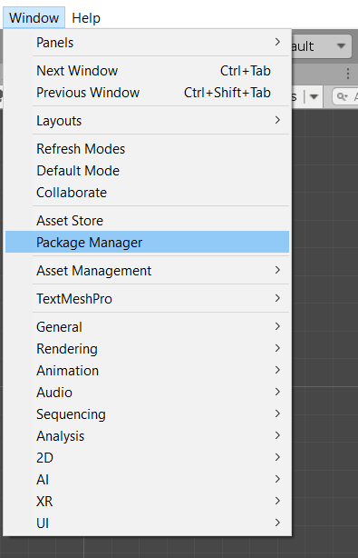
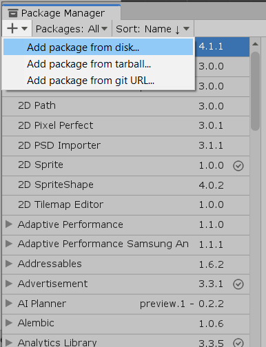
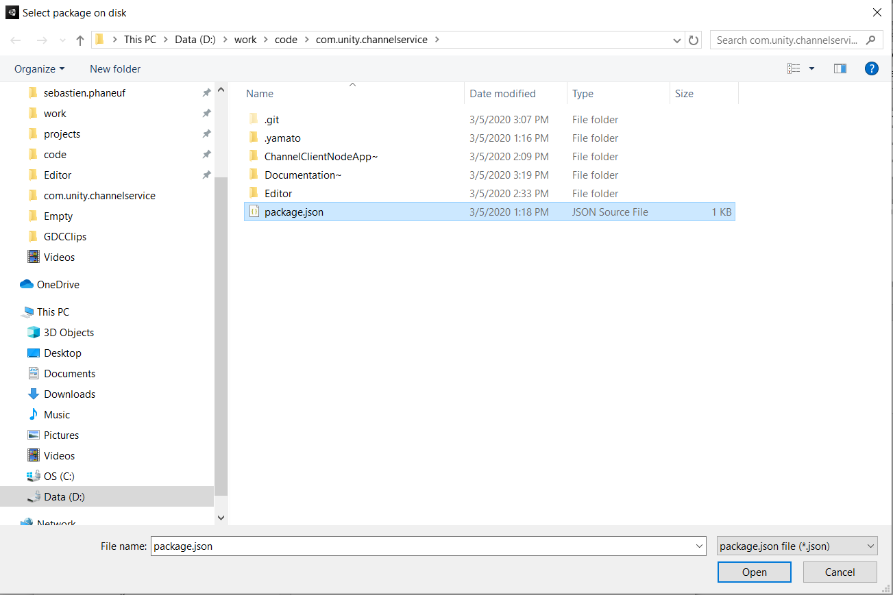
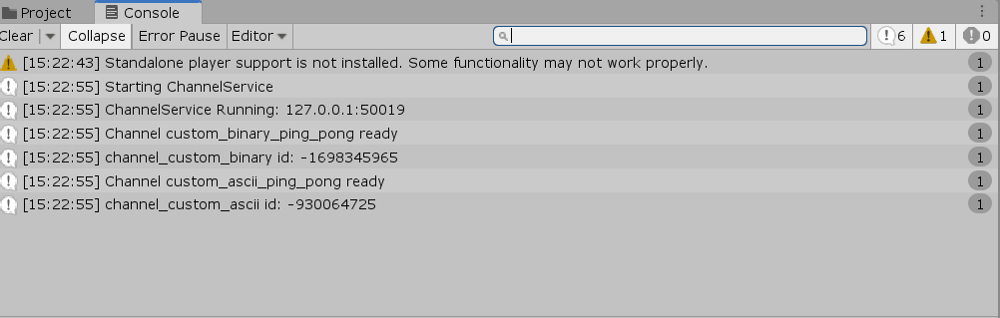
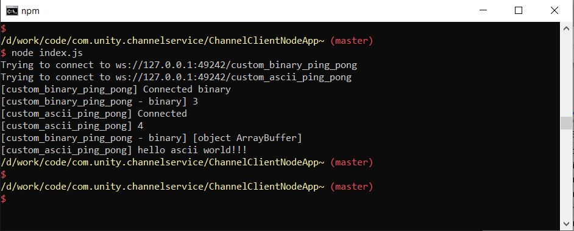

# Channel Client Examples

## Code Walkthrough
- Make a public API for the ChannelService (currently internal). See `Editor/ChannelServiceAPI.cs`
	- Currently in trunk all ChannelService API are internals.
- Make an example implementing 2 new routes, one binary and the other using string. See See `Editor/ChannelServiceExample.cs`
	- This adds a new menu item: `Tools/Register Custom Ping Pong Channels` that can be use to restart the server and register all listeners.
- `ChannelClientNodeApp~` contains a node application that will connect to Unity on the specified routes and send a bit of data.

## How to connect?

- By default, if you use this package the `ChannelService` will be started (basically the Websocket server will be listening for connection) automatically and some handlers will be registered each domain reload.
- The connection address in is : 127.0.0.1:XXXX. Connecting port is dynamic (!). *This should be streamlined...*
- To bypass the fact that the port is dynamic, the StartChannelService function of `ChannelServiceAPI` creates a file `<UserAppData>/Local/Unity/Editor/ChannelService.info` and writes the address and port in that file.

## The Demo

1) Start Unity
2) Ensure you add the `com.unity.channelservice` package.

3) See that the console prints these messages:

4) Install [nodejs](https://nodejs.org/)

5) Open a command console and be sure to `cd` to the `ChannelClientNodeApp~`. Type `node index.js`. 

6) You should see the following:

